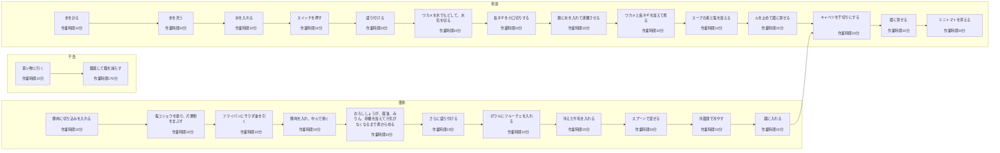

```mermaid

graph LR;
    goto_super["買い物に行く

                  作業時間10分"]

    kome_arau["米を洗う

              作業時間10分"]

    kome_hakaru["米を計る

              作業時間10分"]
　　mizu_ireru["水を入れる

            　作業時間10分"]　
　　suitti_on["スイッチを押す

            　作業時間10分"]
    
    　mori_tukeru["盛り付ける

            　作業時間10分"]

　　　buta_ireru["豚肉に切り込みを入れる

              作業時間10分"]
    sio_komugi["塩コショウを振り、片栗粉をまぶす

              作業時間10分"]

    abura_siku["フライパンにサラダ油を引く

              作業時間10分"]

    buta_yaku["豚肉を入れ、中火で焼く

              作業時間10分"]

　ni_karameru["おろししょうが、醤油、みりん、砂糖を加えて汁気がなくなるまで煮からめる

              作業時間10分"]

sarani_moru["さらに盛り付ける

              作業時間10分"]

        wakame_modosu["ワカメを水でもどして、水気を切る

              作業時間10分"]

naganegi_koguti["長ネギを小口切りする

              作業時間10分"]

nabe_mizu["鍋に水を入れて沸騰させる

              作業時間10分"]

waakame_niru["ワカメと長ネギを加えて煮る

              作業時間10分"]

supu_sio["スープの素と塩を加える

              作業時間10分"]

utuwa_yoseru["火を止めて器に寄せる

              作業時間10分"]

kyabetu_sengiri["キャベツを千切りにする　　　

              作業時間10分"]

utuwa_yoseru2["器に寄せる  

              作業時間10分"]

tomato_soeru["ミニトマトを添える　　　

              作業時間10分"]

bouru_furutye["ボウルにフルーチェを入れる

              作業時間10分"]

hieta_gyunyu["冷えた牛乳を入れる

              作業時間10分"]

ma_zeru["スプーンで混ぜる

              作業時間10分"]

hi_yasu["冷蔵庫で冷やす

              作業時間10分"]

utuwa_ireru["器に入れる

              作業時間10分"] 


    do_situps["腹筋して腹を減らす

                作業時間170分"]


%% 千浩のフロー

subgraph "千浩"

 direction LR

 goto_super--->do_situps

end


%% 剣豪のフロー

subgraph "剣豪"

 direction LR

 kome_hakaru-->kome_arau-->mizu_ireru-->suitti_on-->mori_tukeru-->wakame_modosu-->naganegi_koguti-->nabe_mizu-->waakame_niru-->supu_sio-->utuwa_yoseru-->kyabetu_sengiri-->utuwa_yoseru2-->tomato_soeru;

end


 utuwa_ireru-->kyabetu_sengiri


%% 亜弥のフロー

subgraph "亜弥"

direction LR

  buta_ireru-->sio_komugi-->abura_siku--> buta_yaku-->ni_karameru-->sarani_moru--> bouru_furutye-->hieta_gyunyu-->ma_zeru-->hi_yasu-->utuwa_ireru;

end


```