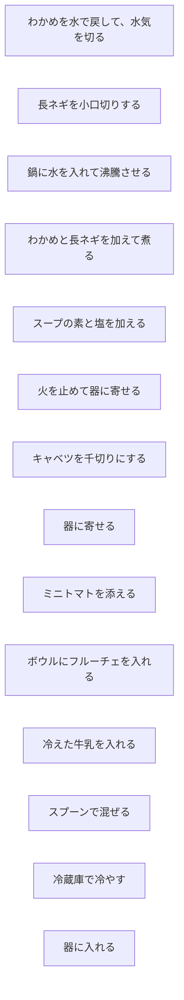

```mermaid
flowchart LR
    id3_1[わかめを水で戻して、水気を切る]
    id3_2[長ネギを小口切りする]
    id3_3[鍋に水を入れて沸騰させる]
    id3_4[わかめと長ネギを加えて煮る]
    id3_5[スープの素と塩を加える]
    id3_6[火を止めて器に寄せる]

    id4_1[キャベツを千切りにする]
    id4_2[器に寄せる]
    id4_3[ミニトマトを添える]

    id5_1[ボウルにフルーチェを入れる]
    id5_2[冷えた牛乳を入れる]
    id5_3[スプーンで混ぜる]
    id5_4[冷蔵庫で冷やす]
    id5_5[器に入れる]
```