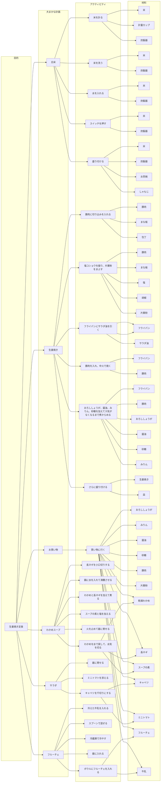

```mermaid
flowchart LR
    goal["生姜焼き定食"]
    id1["白米"]
    id2["生姜焼き"]
    id3["わかめスープ"]
    id4["サラダ"]
    id5["フルーチェ"]
    id6["お買い物"]

    id1-1["米を計る"]
    id1-2["米を洗う"]
    id1-3["水を入れる"]
    id1-4["スイッチを押す"]
    id1-5["盛り付ける"]

    id2-1["豚肉に切り込みを入れる"]
    id2-2["塩コショウを振り、片栗粉をまぶす"]
    id2-3["フライパンにサラダ油を引く"]
    id2-4["豚肉を入れ、中火で焼く"]
    id2-5["おろししょうが、醤油、みりん、砂糖を加えて汁気がなくなるまで煮からめる"]
    id2-6["さらに盛り付ける"]
    
    id3_1[わかめを水で戻して、水気を切る]
    id3_2[長ネギを小口切りする]
    id3_3[鍋に水を入れて沸騰させる]
    id3_4[わかめと長ネギを加えて煮る]
    id3_5[スープの素と塩を加える]
    id3_6[火を止めて器に寄せる]
    
    id4_1[キャベツを千切りにする]
    id4_2[器に寄せる]
    id4_3[ミニトマトを添える]

    id5_1[ボウルにフルーチェを入れる]
    id5_2[冷えた牛乳を入れる]
    id5_3[スプーンで混ぜる]
    id5_4[冷蔵庫で冷やす]
    id5_5[器に入れる]
    
    id6-1["買い物に行く"]

    id1-1-1["米"]
    id1-1-2["計量カップ"]
    id1-1-3["炊飯器"]

    id1-2-1["米"]
    id1-2-2["炊飯器"]

    id1-3-1["米"]
    id1-3-2["炊飯器"]

    id1-4-1["米"]
    id1-4-2["炊飯器"]

    id1-5-1["米"]
    id1-5-2["炊飯器"]
    id1-5-3["お茶碗"]
    id1-5-4["しゃもじ"]


    id2-1-1["豚肉"]
    id2-1-2["まな板"]
    id2-1-3["包丁"]

    id2-2-1["豚肉"]
    id2-2-2["まな板"]
    id2-2-3["塩"]
    id2-2-4["胡椒"]
    id2-2-5["片栗粉"]

    id2-3-1["フライパン"]
    id2-3-2["サラダ油"]

    id2-4-1["フライパン"]
    id2-4-2["豚肉"]

    id2-5-1["フライパン"]
    id2-5-2["豚肉"]
    id2-5-3["おろししょうが"]
    id2-5-4["醤油"]
    id2-5-5["砂糖"]
    id2-5-6["みりん"]

    id2-6-1["生姜焼き"]
    id2-6-2["皿"]

    id6-1-1["おろししょうが"]
    id6-1-2["みりん"]
    id6-1-3["醤油"]
    id6-1-4["砂糖"]
    id6-1-5["豚肉"]
    id6-1-6["片栗粉"]
    id6-1-7["乾燥わかめ"]
    id6-1-8["長ネギ"]
    id6-1-9["スープの素"]
    id6-1-10["キャベツ"]
    id6-1-11["ミニトマト"]
    id6-1-12["フルーチェ"]
    id6-1-13["牛乳"]
    

    subgraph "目的"
        goal
    end

    goal --> id1
    goal --> id2
    goal --> id3
    goal --> id4
    goal --> id5
    goal --> id6

    subgraph "大まかな計画"
        id1
        id2
        id3
        id4
        id5
        id6
    end

    subgraph "アクティビティ"
        id1 --> id1-1
        id1 --> id1-2
        id1 --> id1-3
        id1 --> id1-4
        id1 --> id1-5

        id2 --> id2-1
        id2 --> id2-2
        id2 --> id2-3
        id2 --> id2-4
        id2 --> id2-5
        id2 --> id2-6

        id3 --> id3_1
        id3 --> id3_2
        id3 --> id3_3
        id3 --> id3_4
        id3 --> id3_5
        id3 --> id3_6

        id4 --> id4_1
        id4 --> id4_2
        id4 --> id4_3

        id5 --> id5_1
        id5 --> id5_2
        id5 --> id5_3
        id5 --> id5_4
        id5 --> id5_5

        id6 --> id6-1
    end

    subgraph "材料"
        id1-1 --> id1-1-1
        id1-1 --> id1-1-2
        id1-1 --> id1-1-3

        id1-2 --> id1-2-1
        id1-2 --> id1-2-2

        id1-3 --> id1-3-1
        id1-3 --> id1-3-2

        id1-4 --> id1-4-1
        id1-4 --> id1-4-2

        id1-5 --> id1-5-1
        id1-5 --> id1-5-2
        id1-5 --> id1-5-3
        id1-5 --> id1-5-4

        id2-1 --> id2-1-1
        id2-1 --> id2-1-2
        id2-1 --> id2-1-3

        id2-2 --> id2-2-1
        id2-2 --> id2-2-2
        id2-2 --> id2-2-3
        id2-2 --> id2-2-4
        id2-2 --> id2-2-5

        id2-3 --> id2-3-1
        id2-3 --> id2-3-2
        
        id2-4 --> id2-4-1
        id2-4 --> id2-4-2

        id2-5 --> id2-5-1
        id2-5 --> id2-5-2
        id2-5 --> id2-5-3
        id2-5 --> id2-5-4
        id2-5 --> id2-5-5
        id2-5 --> id2-5-6

        id2-6 --> id2-6-1
        id2-6 --> id2-6-2

        id2-3 --> id2-3-1

        id3_1 --> id6-1-7
        id3_1 --> id6-1-8
        id3_1 --> id6-1-9

        id4_1 --> id6-1-10
        id4_1 --> id6-1-11

        id5_1 --> id6-1-12
        id5_1 --> id6-1-13

        id6-1 --> id6-1-1
        id6-1 --> id6-1-2
        id6-1 --> id6-1-3
        id6-1 --> id6-1-4
        id6-1 --> id6-1-5
        id6-1 --> id6-1-6
        id6-1 --> id6-1-7
        id6-1 --> id6-1-8
        id6-1 --> id6-1-9
        id6-1 --> id6-1-10
        id6-1 --> id6-1-11
        id6-1 --> id6-1-12
        id6-1 --> id6-1-13

    end
```